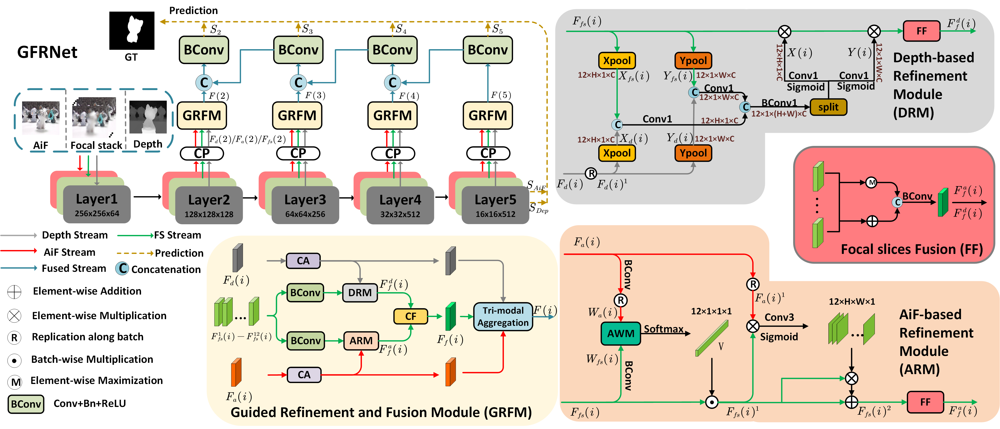
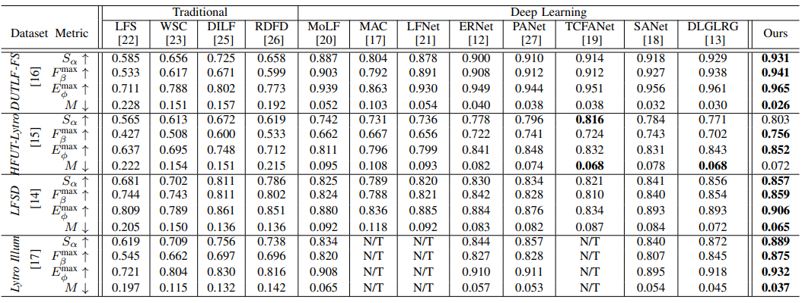

# GFRNet
Official code repository for paper **Guided Focal Stack Refinement Network for Light Field Salient Object Detection** ([ICME2023](https://arxiv.org/abs/2305.05260)).
Coming soon!

## Overall Architecture
<p align="center">
     <br />
 <em> 
     Overall architecture of the proposed GFRNet.
    </em>
</p>

## Inference
Download the pretrained model at [Baidu Driver](https://pan.baidu.com/s/1n0TT-R5oqmk4lZ_K9d0rGw) (PSW: xmhu).

Generate saliency maps:
- Run `python test.py`


## Results
<p align="center">
     <br />
 <em> 
     Quantitative Results. The best result is highlighted in bold. “N/T” denotes unavailable results. ↑/↓ means that a larger/smaller value is better.
    </em>
</p>

 ### Download
The saliency maps can be download from [Baidu Driver](https://pan.baidu.com/s/1D5Jqr7ql9ZPcV_tAshRYgg) (PSW: 1iuf).

## Citation
Please cite the following paper if you use this repository in your research:
```
@article{yuan2023guided,
  title={Guided Focal Stack Refinement Network for Light Field Salient Object Detection},
  author={Yuan, Bo and Jiang, Yao and Fu, Keren and Zhao, Qijun},
  journal={arXiv preprint arXiv:2305.05260},
  year={2023}
}
```
Any questions regarding this work can contact yuanboera@qq.com.
